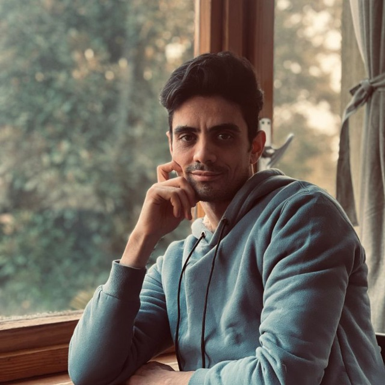
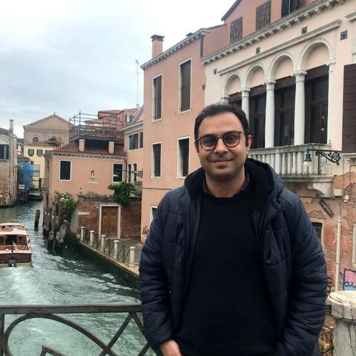

# WebGIS Project 
NORTH-SONDRIO GIS PROJECT
ANALYSIS OF THE NORTH REGION OF SONDRIO THROUGH LANDSLIDE SUSCEPTIBILITY MAPPING
## Overview
This project is part of a GIS course and demonstrates the creation of a WebGIS application. It includes multiple HTML pages detailing the project's objectives, technologies used, and results achieved. The application displays a web map with various layers, computed error matrices, and population counts.
## About Us
### Meet Our Team
Three Geoinformatics Engineering students at Politecnico di Milano

<div style="display: flex; justify-content: space-around; text-align: center;">

<div style="flex: 1; margin: 10px;">

<h4>Moein Peyghambar Zadeh</h4>
<p>Born in Iran, Qom<br>
BSc in Computer science<br>
AI and Deep Learning enthusiast<br>
Gym, Adventure and Gardening.</p>
<p>
<a href="mailto:seyed.peyghambar@mail.polimi.it" class="icon solid fa-envelope">Mail</a> |
<a href="https://github.com/moeinp70" class="icon brands fa-github">Github</a> |
<a href="https://www.linkedin.com/in/moein-peyghambarzadeh/" class="icon brands fa-linkedin">Linkedin</a>
</p>
</div>

<div style="flex: 1; margin: 10px;">

<h4>Saeed Mehdizadeh</h4>
<p>Born in Iran, Bijar<br>
BSc in Geomatics<br>
Remote sensing expert<br>
Main Hobby: Videography.</p>
<p>
<a href="mailto:saeed.mehdizadeh@mail.polimi.it" class="icon solid fa-envelope">Mail</a> |
<a href="https://github.com/saeedmehdizadeh" class="icon brands fa-github">Github</a> |
<a href="https://www.linkedin.com/in/saeed-mehdizadeh-a7099320b/" class="icon brands fa-linkedin">Linkedin</a>
</p>
</div>

<div style="flex: 1; margin: 10px;">

<h4>Ali Moeinkhah</h4>
<p>Born in Iran, Tehran<br>
BSc in Surveying Engineering<br>
Earth observation from space avid<br>
Reading novel books.</p>
<p>
<a href="mailto:ali.moeinkhah@mail.polimi.it" class="icon solid fa-envelope">Mail</a> |
<a href="https://github.com/alimoeinkhah" class="icon brands fa-github">Github</a> |
<a href="https://www.linkedin.com/in/ali-moeinkhah" class="icon brands fa-linkedin">Linkedin</a>
</p>
</div>

</div>

## Project Structure
- **Home Page (`index.html`)**: Introduction to the project.
- **About Us Page (`about.html`)**: Information about the team and project background.
- **Intro Page (`intro.html`)**: Detailed introduction to the project objectives and scope.
- **Results Page (`results.html`)**: Display of results, including error matrices and population counts.
- **Web Page (`web.html`)**: Additional project-related content.
- **WebGIS Page (`webgis.html`)**: Interactive web map with various layers.
- **Work Page (`work.html`)**: Details on the work and methodologies used in the project.

## Technologies and Data
- **Web Mapping Library**: OpenLayers (recommended) or other web mapping libraries.
- **Base Maps**: OpenStreetMap (OSM) and another base map.
- **Controls**: Scale Line, Full Screen, Mouse Position.
- **Layers**: 
  - Computed susceptibility map
  - Preprocessed environmental factor layers (optional)
  - Preprocessed population raster dataset and susceptibility raster map

## Installation
1. Clone the repository.
2. Navigate to the project directory.
3. Install dependencies:
    ```sh
    npm install
    ```
4. Start the development server:
    ```sh
    npm run dev
    ```

## Usage
Open `index.html` in your web browser to navigate through the pages and view the WebGIS application.

## Key Files
- `index.html`: Home page.
- `about.html`: About Us page.
- `intro.html`: Introductory page.
- `results.html`: Results page with error matrices and population counts.
- `web.html`: Additional project content.
- `webgis.html`: WebGIS page with interactive map.
- `work.html`: Details on methodologies used.
- `assets/`: Directory containing images and other assets.
- `package.json`, `package-lock.json`: Node.js package files.
- `vite.config.js`: Configuration file for Vite.
- `LICENSE`: License information.
- `README.md`: This file.

## Figures and Screenshots
The website uses figures and screenshots to illustrate the work and choices made during the project development.

## Critical Discussion
The results of the calculations, including error matrices and population counts, are critically discussed on the Results page (`results.html`). This includes an explanation of the choices made, options set, and problems encountered.

---